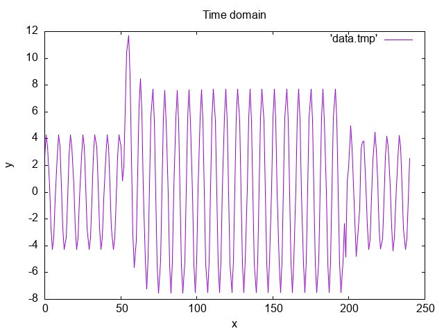

# Phasor Estimation Filters

This repository contains source code for DFT-based phasor estimation filters. The filters are implemented as a code library that can be included in your project to perform phasor estimation using various filter techniques.

## Features

- Discrete Fourier Transform (DFT): Full-cycle and half-cycle implementations.
- Sine and Cosine Filters: Evaluate the real and imaginary components using sine and cosine functions.
- Sliding Buffer: A ring buffer implementation for handling continuous data streams.

## Usage

### Prerequisites

Make sure you have the following tools installed:

- CMake: For building the project.
- GNUplot: For plotting the results (optional).

### Cloning the repository

To get started, clone the repository to your local machine:

```
git clone https://github.com/washburn961/phasor-estimation-filters.git
cd phasor-estimation-filters
```

### Building the Library

Create a build directory and compile the library using CMake:

```
mkdir build
cd build
cmake ..
cmake --build .
```

### Usage

To use the library in your project, include the appropriate headers and link against the compiled library. Below are examples of how to initialize and use the different filters provided.

#### Sine Filter

```
#include "sine_filter.h"

SineFilter sineFilter;
SineFilter_Init(&sineFilter);

float input[SINE_FILTER_SIZE] = { /* your input data */ };
SineFilter_Evaluate(&sineFilter, input, SINE_FILTER_SIZE);

float magnitude = SineFilter_GetMag(&sineFilter, 0);
float phase = SineFilter_GetPhase(&sineFilter, 0);
```

#### Cosine Filter

```
#include "cosine_filter.h"

CosineFilter cosineFilter;
CosineFilter_Init(&cosineFilter);

float input[COSINE_FILTER_SIZE] = { /* your input data */ };
CosineFilter_Evaluate(&cosineFilter, input, COSINE_FILTER_SIZE);

float magnitude = CosineFilter_GetMag(&cosineFilter, 0);
float phase = CosineFilter_GetPhase(&cosineFilter, 0);
```

#### Full-Cycle Fourier Transform

```
#include "fourier_transform.h"

FourierTransform ft;
FourierTransform_Init(&ft);

float input[DFT_SIZE] = { /* your input data */ };
FourierTransform_Evaluate(&ft, input, DFT_SIZE);

float magnitude = FourierTransform_GetMag(&ft, 0);
float phase = FourierTransform_GetPhase(&ft, 0);
```

#### Half-Cycle Fourier Transform

```
#include "half_cycle_fourier_transform.h"

HalfCycleFourierTransform hcft;
HalfCycleFourierTransform_Init(&hcft);

float input[HCDFT_SIZE] = { /* your input data */ };
HalfCycleFourierTransform_Evaluate(&hcft, input, HCDFT_SIZE);

float magnitude = HalfCycleFourierTransform_GetMag(&hcft, 0);
float phase = HalfCycleFourierTransform_GetPhase(&hcft, 0);
```

#### Sliding Buffer

```
#include "ring_buffer.h"

SlidingBuffer buffer;
SlidingBuffer_Init(&buffer);

float data = /* new data */;
SlidingBuffer_Write(&buffer, data);

float samples[BUFFER_SIZE];
SlidingBuffer_GetSamples(&buffer, samples, BUFFER_SIZE);
```

## Example

This is a plot showing an assymetrical fault current versus time:



When running the example, it will compute the 8 samples per cycle DFT for all the current samples data and output the magnitude of the 60 Hz component versus time:


## Contributing
Contributions are welcome! Please submit a pull request or open an issue to discuss your ideas or report bugs.

## License
This project is licensed under the MIT License. See the LICENSE file for more details.
