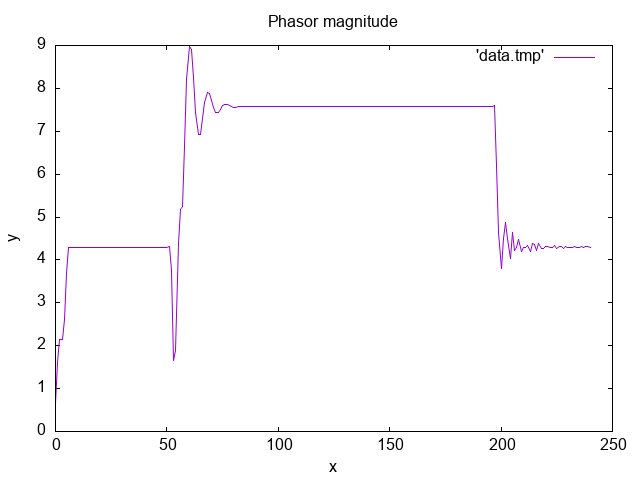

# Phasor Estimation Filters

This repository contains source code for DFT-based phasor estimation filters.

## Usage

The following steps show you how to run the example contained in main.c.

1. Clone the repository:

```git clone https://github.com/washburn961/phasor-estimation-filters.git```

2. 


